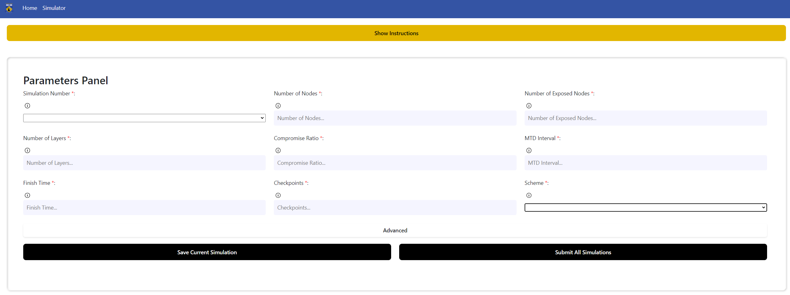

# About 

This is a web based application designed to help users learn about Moving Target Defence (MTD) techniques. 
After launching the application using the instructions below, the simulator page can be used to visualise 
MTD techniques with various configurations. Up to 5 graphs can be displayed at any given time, and the results 
can be compared graphically with the statistics below each graph. 

# Detailed usage 

## Running the application 

### Using Docker

This web-application has been configured to use a docker container, so can be launched 
simply using that. If you do not have docker, download it from [here](https://www.docker.com/products/docker-desktop/). 
Ensure you are working from the main directory, then use the following 
command to activate the web-app using docker: 

>  `docker-compose up -d --build`

The application should then launch on localhost:8080

## Navigating to the simulation

Open the application on localhost:8080, and use the navigation bar to click the 'Simulation' tab.

## Producing simulated networks 

The simulation should have an instructions tab at the top detailing how the simulation operates. The parameters panel specifies what configuration variables you want to simulate. 

1. After inputting some parameters, you have to save them using the 'Save Current Graphs' button. For more detailed instructions about each option, either see the tooltips or the 'Show Instructions' tab.
    * Click on the Advanced tab for more configuration options. 

2. After creating the desired number of graphs using the 'Add Simulation' button and saving their individual configurations, press the 'Submit All Graphs' button to generate the graphs. 

3. If the above steps have been performed correctly, you should see a message saying 'Receiving graph...'. The generation of the graphs may take some time so please be patient. 

4. After all graphs have been completed, you should see a message saying 'Successfully recieved graphs'. You are now free to examine the results of the graphs. 

## Evaluating the simulation results

Now the simulations should be complete, and a timeline of the simulation and final results can be observed. 

1. Scroll down until you see a box with the name of the graph you created. 

2. Click that box. A graph container should appear. 

3. Click the start button to automatically walk through all snapshots, or the step forward and backward buttons to just view the relevant snapshot. Compromised nodes appear red, exposed nodes (neighbours of compromised nodes) appear yellow and normal nodes appear green. 

4. To view aggregated results for the simulation, click one of the four buttons at the bottom of the container. These should display statistic graphs obtained at the end of the simulation.
    1. Network - Displays the layout of the network
    2. MTD record - Displays the MTD techniques used by the defender  
    3. Attack record - Displays the attack techniques attempted by the attacker 
    4. Attack action - Shows which attack operations were used on which nodes

## Simulation details

This application has been built off of the MTDSimTime and other repositories here. For more 
detailed information about MTD techniques, please check out the following links.

[MTDSimTime](https://github.com/MoeBuTa/MTDSimTime): The simulation used for our application. 

# Scope for future work

## Expanding the introductory page

By default the information presented on this page include the title, a welcome to the page, and a small description of the project outline.

### Backend requirements 

No changes in the backend are required.

### Frontend requirements 

The main page information is in frontend/Vite/src/components/Home.vue.
To edit this page, simply insert the 'p' tag to add more information and to change the style edit within '.p' in the style tag.

## Expanding advanced configuration options 

The advanced configuration is set using backend/mtdgui/simulator/mtdnetwork/configs.py. 
This will read by default from a default_config.json file (mtdnetwork/data/default_config.json) containing the default 
configuration variables. A full list of variables that can be added to the configuration 
options can be found in that file. 

Currently, when advanced parameters are submitted by the user they are handled by the multi-graph-params endpoint, and are processed in the 
backend/mtdgui/controllers/pools.py handleRequest() function. The current processing should work when adding more options. To add more options, some changes to the frontend and backend will be necessary.  

### Backend requirements 

The models will have to be updated to receive the updated configurations. In models/forms.py create a new Class inheriting BaseModel, and add the required variables. The attributes should have exactly the same names as the keys and values in the default_config.json file, as they are simply merged with the defaults to create the final config used in the simulations. 

After creating the model, add it to the ConfigModel class. As they are optional use Union\[Class_Name,None] so that None is used by default, as None values from input parameters are ignored when creating the final configuration. 

### Frontend requirements

The advanced layout options is set in frontend/Vite/src/components/MTDSimulator.vue. 
To add more options in the advanced options tab look for the 'p' tag with the class 'advanced'. Below this are where the advanced options are displayed.
Refer to the code above and below to include another input box or selector. Doing this will extend the advanced section of the panel parameter.

To link the new parameter to the backend, first validate it in the checkAdvancedDataEntered() function but adding the variable to the code. Then go to the saveForm() function and add it to the validation list, following a similar structure to the ones already incorporated.

## Hosting remotely

As the application is already dockerised, the easiest way to host this remotely is to convert it into a [Kubernetes](https://kubernetes.io/docs/home/) cluster. This cluster could then be hosted by Google Cloud or other cloud providers. 

Kubernetes suggests [Kompose](https://kubernetes.io/docs/tasks/configure-pod-container/translate-compose-kubernetes/), to convert docker-compose files (such as the one in the base directory of this application) to Kubernetes readable files. 

This could then be deployed to a number of cloud providers, making the application remotely accessible. There should be specific guides about this process depending on the chosen provider, such as this one for [Google Cloud](https://z2jh.jupyter.org/en/latest/kubernetes/google/step-zero-gcp.html).